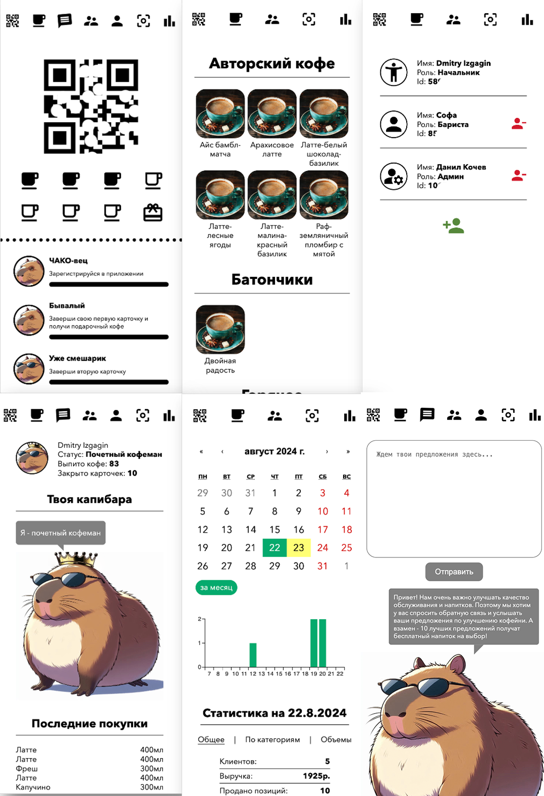
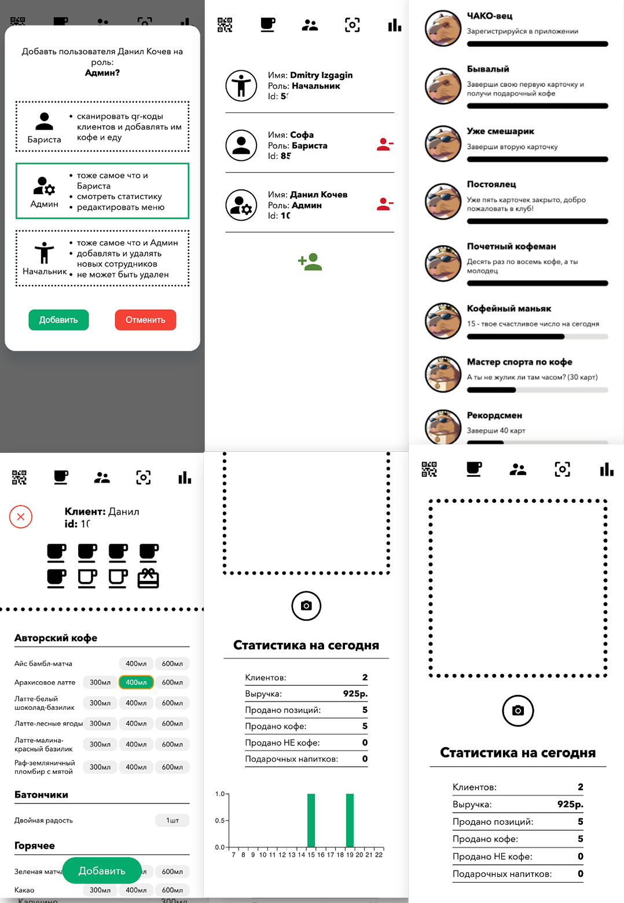
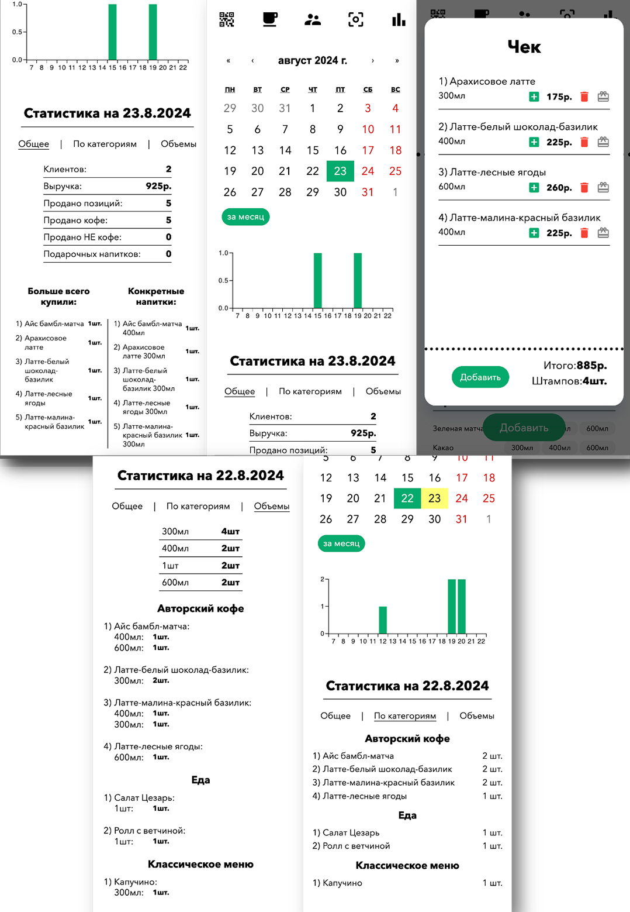

# Simple deploy Telegram Coffee App
### Простое в развертывании приложение для кофейни (или любого бизнеса)

## About
- У тебя малый бизнес и нет денег на приложение?
- Боишься что клиенты не захотят скачивать твое навороченное приложение потому что у них и так их много?

### Есть решение - Приложение для малого бизнеса которое открывается через telegram!
У пользователя больше не будет отговорки "у меня и так много приложений" - телеграм есть у всех.

Приложение выглядит красиво и функционально.

И ключевая особенность: простота развертывания для использования в реальной среде. В качестве БД и хостинга используется firebase, для полноценного использования достаточно клониовать проект, развернуть firebase и привязать к телеграм боту.

Проект представляет из себя телеграм приложение для малого бизнеса с возможностями:

1) Автоматической регистрации пользователей (благодаря Telegram Mini Apps)
2) Ведением финансовой статистики
3) Функционалом для клиента кофейни:
- учет скидочной программы (в данном случае - восьмой кофе в подарок)
- учет статистики покупок
- отслеживание прогресса путем роста его капибары (маскота кофейни, чтобы поменять см. дальше)
- отправки обратной связи
4) Функционалом для администратора кофейни:
- редактирование списка барист
- остлеживание финансовой статистики
5) Функционалом для баристы:
- работа с клиентами
- редактирование меню

## How to start
1) `git clone ...`
2) [Создать проект firebase](https://firebase.google.com/docs/projects/api/workflow_set-up-and-manage-project?hl=ru)
3) [Создать real time database](https://firebase.google.com/docs/database?hl=ru)
4) [Получить firebaseConfig](https://firebase.google.com/docs/database/web/start?hl=ru) и заполнить его в './src/firebase/index.ts'
5) `npm i`
6) В файле './src/pages/MainPage/MainPage.tsx' написать на месте `const myTgId = 0` свой telegram id
7) В этом же файле поменять `isDev` на нужный параметр (true - для разработки, false - для деплоя)
8) `npm run dev`

## How to deploy
9) [Залить проект на хост firebase](https://firebase.google.com/docs/hosting?hl=ru)
9) [Подключить задеплоенное приложение в телеграм бота](https://core.telegram.org/bots/webapps)

## How to improve
Проект легко изменяемый и масштабируемый. Хочешь заменить маскота на своего? - Замени картинки в './src/assets/'. Хочешь свои правила подсчета скидки/подарочного кофе? - Все находится здесь и все можно поменять. Основное преимущество такого решения - не нужно разворачивать тонну сервисов и баз данных. Приложение разворачивается в телеграме и пользователю не нужно скачивать лишнее приложение.

Развернутый проект уже существует и прекрасно функционирует. 

---

---

---

---